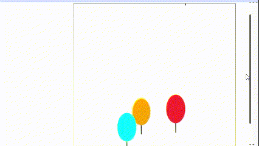
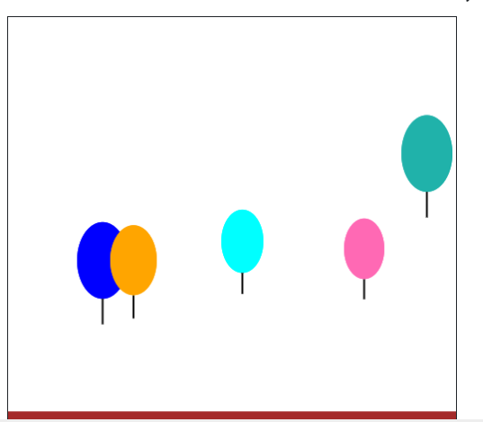

# 🎈 Balloon Animation - Code in Place Final Project

 *Example of balloons floating upward*

## Project Overview

This repository contains my final project submission for **Stanford University's "Code in Place"** Python course. As part of the course requirements, students were tasked with creating an original program using either:
- Karel the Robot
- Console-based interfaces
- Graphical interfaces

I chose to implement a **graphical animation** using Python's graphics library, creating a visually appealing simulation of colorful balloons floating upward.

## Project Features

- 🎈 **Animated balloons** emerging from the bottom of the screen
- 🌈 **Randomly colored balloons** with proportional string attachments
- ⏱️ **Smooth animation** at approximately 60 FPS
- 🌳 **Ground plane** for visual reference
- 🎯 **Object-oriented design** with a Balloon class
- 🚀 **Dynamic creation and removal** of balloons (max 3 on screen)

## Screenshot and Demo

  
[🔗 Watch Demo](https://youtu.be/_-5Fd90v4Ao)

## Repository Structure

balloon-animation/
├── balloon.py # Main Python file
├── requirements.txt # Dependencies
├── demo.gif # Animated preview
├── screenshot1.png # Project screenshot
└── README.md # This documentation

## How to Run

1. Install requirements: **pip install -r requirements.txt**
2. Execute program: **python balloon.py**
3. Press **Ctrl+C** to stop animation

